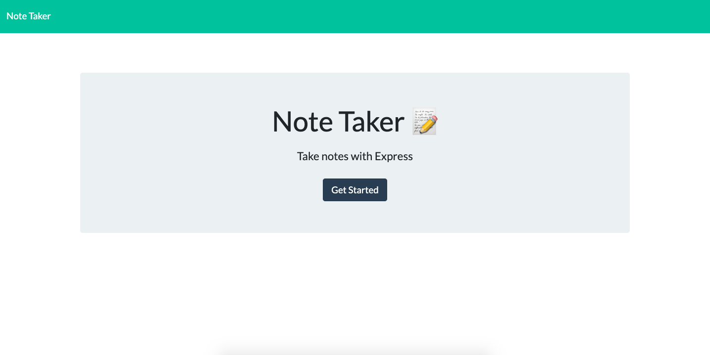

# Note-Taker

An application for writing notes that can be saved to or deleted from a JSON file. Note Taker application is hosted on Heroku.


[Visit the Application on Heroku](https://note--taker.herokuapp.com/)

## Table of Contents

- [Purpose](#purpose)
- [User Story](#userstory)
- [Usability](#Usability)
- [Technologies](#technologies)

## Purpose

Note Taker is an application for writing, saving, and deleting notes. This application uses an express backend which saves and retrieves note data from a JSON file. The front end of this application was developed for students in the UW Full Stack Web Development Bootcamp, and it was our task to develop the backend. The core of this project was the creation of HTML and API routes which accomplished communication betweeen the frontend and backend. These routes were built with `GET`, `POST`, and `DELETE` methods.

## User Story

```
AS A user, I want to be able to write and save notes
I WANT to be able to delete notes I've written before
SO THAT I can organize my thoughts and keep track of tasks I need to complete
```

## Technologies

- Heroku
- Node.js
- Express
- Nodemon
- Path
- fs

## Usability

1. Users begin by entering a Note Title, and then begin typing in the note body. Once both the note title and note body hold value a save button appears in the top right corner of the navigation bar. Once the user is satisfied with the contents of the note, they will click save, and the note will be redered in the left note navigation bar. The note will be stored on the server until deleted by the user.

[View Note Creation and Saving Demonstration via GIPHY](https://giphy.com/embed/cOQmlJolae5WY8jvWu)

2. The user can delete notes from the Note Taker application by selecting the red trash can adjacent to the note in the left side note navigation bar.
